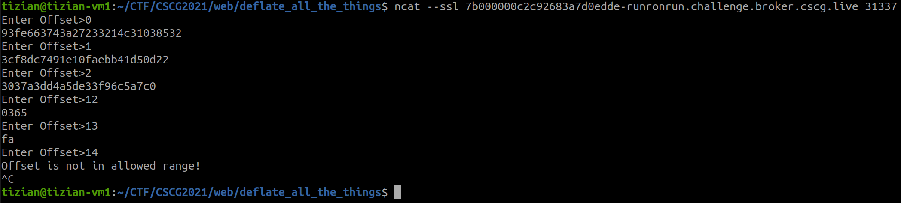

# RunRonRun

Category: Cryptography, RC4
Created: Mar 3, 2021 7:47 PM
Solved: Yes
Subjective Difficulty: 🔥🔥🔥🔥🔥

# WriteUp:

Author: @Tibotix

This was a challenge in the CSCG2021 Competition.

## 📃 Challenge Description:

Run Ron, Run!

## 🔎 Research:

We are given a python script that is taking an index at which offset the flag should be decrypted with RC4. By simple try and error we can see that the flag is `14` bytes long.



## 📝 Vulnerability Description:

RC4 has [known issue](https://en.wikipedia.org/wiki/RC4#Security)s in the Key-Scheduling-Algorithm (KSA), which lets the second byte of a ciphertext tend to be zero twice as possible as other characters. This allows us to to a statisctical analysis of a bunch of collected ciphertexts in the RC4 broadcast mode. 

To be more precise:
When the second byte in the keystream $Z_2$ is 0, the ciphertext will be the same as the original message:

$C_2 = M_2 \bigoplus Z_2 = M_2 \bigoplus 0 = M_2$.

To get the most probable plaintext byte at position 2, simple search the most frequent ciphertext byte at position 2.

## 🧠 Exploit Development:

I made a python script that collects $10000$ samples of the encrypted flag using the offsets `0` till `11` and statistically assumes the most common byte at the second byte position in the ciphertext as the byte in the plaintext. Offset `12` is not processed as it is clear that this has to be the closing `}` in the flag format.

## 🔐 Exploit Program:

```python
from pwn import *
import os

class TextByte():
    def __init__(self, b):
        self.byte = b

class Text():
    def __init__(self, num, length):
        self.bytes = num.to_bytes(length, 'big')

    def __getitem__(self, i):
        return TextByte(self.bytes[i])

    def __len__(self):
        return len(self.bytes)

    @classmethod
    def from_hex(cls, hex_string, length):
            return cls(int(hex_string, 16), length)

    @classmethod
    def from_string(cls, string, length, encoding='utf-8'):
        return cls(int.from_bytes(bytes(string, encoding=encoding), 'big'), length)

def stream_ciphertexts():
    with open(os.path.realpath('./ciphertexts.txt'), 'r') as f:
            for line in f.readlines():
                yield Text.from_hex(line, 14)

def get_ciphertext(p, offset):
    p.recvuntil("Offset>")
    p.sendline(str(offset))
    return Text(int(p.recvline(), 16), 14-offset)

def get_offset_ciphertexts(p, offset, num):
    for i in range(num):
        yield get_ciphertext(p, offset)

# get most frequency ciphertext at position 2
def basic_single_byte_recovery_attack(p, offset):
    N = [0 for i in range(0xff+1)]
    for ciphertext in get_offset_ciphertexts(p, offset, 10000):
        N[ciphertext[1].byte] += 1
    return N.index(max(N))

p = remote(sys.argv[1], int(sys.argv[2]), ssl=True)
flag_length = 14

for r in range(flag_length-2):
    P = basic_single_byte_recovery_attack(p, r)
    print("Byte at offset {0}: {1}->{2}".format(str(r+2), hex(P), chr(P)))
```

## 💥 Run Exploit:


**FLAG: CSCG{schnieke}**

## 🛡️ Possible Prevention:

RC4 has known issues and should never be used. Someone implementing a symmetric stream cipher should consider using [Salsa20](https://en.wikipedia.org/wiki/Salsa20) or the patented stream cipher [Rabbit](https://en.wikipedia.org/wiki/Rabbit_(cipher)). 

## 🗄️ Summary / Difficulties:

This challenge was very enjoyable. The vulnerability is very well documented so it was easy to find references. However the collecting of the samples took quite a while, but as you could just lean back and wait this was not a big problem at all.

## 🗃️ Further References:

[RC4 - Wikipedia](https://en.wikipedia.org/wiki/RC4)

https://eprint.iacr.org/2016/063.pdf

https://link.springer.com/chapter/10.1007/978-3-662-43414-7_8

## 🔨 Used Tools:

- pwntools

