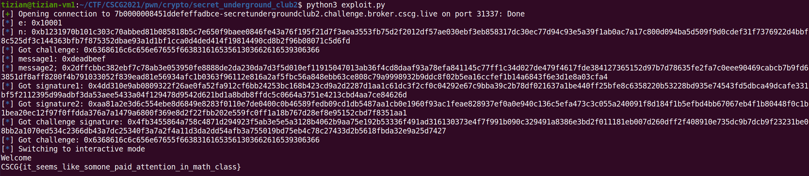

# Secret Underground Club 2

Category: Cryptography, RSA
Created: Mar 1, 2021 11:30 PM
Solved: Yes
Subjective Difficulty: 🔥🔥🔥

# WriteUp:

Author: @Tibotix

This was a challenge in the CSCG2021 Competition.

## 📃 Challenge Description:

We had some issues with the last login system and did some major changes. This time no imposter should be able to get into our secret systems.

## 🔎 Research:

We are provided with a single python file that runs on the server with which we can interact.

```python
from Crypto.PublicKey import RSA
import base64
import os

from secret import FLAG

challenge = int.from_bytes(f"challenge_{os.urandom(8).hex()}".encode(), 'big')

def menu():
    print(
        r"""
[1] Login
[2] Support
[3] Exit
        """
    )
    return int(input("Option:"))

def int_to_bytes(i):
    return i.to_bytes((i.bit_length() + 7) // 8, 'big')

def chat():
    message = int(input("Message:"), 16)

    if b"challenge_" in int_to_bytes(message).lower():
        print("This message looks like a challenge")
    else:
        # TODO: Implement actual chat. Currently it's just a dummy.
        answer = message # put actual answer here
        signature = pow(answer, d, n)
        print(f"{message:x}#{signature:x}")

def login():
    print(f"Provide a valid signature for the following challenge: {challenge:x}")
    signature = int(input("Signature:"), 16)

    if challenge == pow(signature, e, n) and challenge > 1 and signature > 1:
        print("Welcome")
        print(FLAG)
    else:
        print("Sorry mate")

def main():
    global p, q, d, e, n
    key = RSA.generate(1024)

    p, q, d, e, n = key.p, key.q, key.d, key.e, key.n

    print(f"[DEBUG]: e={e:x}")
    print(f"[DEBUG]: n={n:x}")

    print(
    r"""
 ____  _____ ____  ____  _____ _____    _     _      ____  _____ ____  _____ ____  ____  _     _      ____    ____  _     _     ____ 
/ ___\/  __//   _\/  __\/  __//__ __\  / \ /\/ \  /|/  _ \/  __//  __\/  __//  __\/  _ \/ \ /\/ \  /|/  _ \  /   _\/ \   / \ /\/  _ \
|    \|  \  |  /  |  \/||  \    / \    | | ||| |\ ||| | \||  \  |  \/|| |  _|  \/|| / \|| | ||| |\ ||| | \|  |  /  | |   | | ||| | //
\___ ||  /_ |  \_ |    /|  /_   | |    | \_/|| | \||| |_/||  /_ |    /| |_//|    /| \_/|| \_/|| | \||| |_/|  |  \_ | |_/\| \_/|| |_\\
\____/\____\\____/\_/\_\\____\  \_/    \____/\_/  \|\____/\____\\_/\_\\____\\_/\_\\____/\____/\_/  \|\____/  \____/\____/\____/\____/
                                                                                                                                                                                                                         
Welcome to the secret underground club.
To log in please provide a signature with the private key you received.

We had some issues with the login system and changed the procedure. 
If you have problems with the new process please ask our support team (of course all messages are signed by the support team, so you know it's us).
""")

    try:
        while True:
            option = menu()
            print()

            if option == 1:
                login()
            elif option == 2:
                chat()
            else:
                exit(0)
    except SystemExit:
        pass
    except:
        print("Computer is tired. Computer is going to sleep.")
        exit(1)

if __name__ == '__main__':
    main()
```

## 📝 Vulnerability Description:

We have the ability to ask the server to sign us anything we want. This gives us the power to sign a predefined message without actually knowing the private key neither asking the server to sign this specific message. This attack is also know as the [Chosen-Message-Attack](https://www.notion.so/Chosen-Message-Attack-e4ef4c3b927243c884d55300edcfa3ad).

## 🧠 Exploit Development:

The goal of this challenge is that we provide a valid signature for a challenge message that is chosen by the server. However, we could get arbitrary signatures for any chosen message except the actual challenge of course.

The signature of the challenge will be calculated with the private key like this:

$$s = m^d \pmod n$$

To get the signature $s$ , the Chosen-Message-Attack on RSA Signatures works as follows:

1. Given a message $m_1$ of your choice, you ask the server to sign that message giving us $s_1 = m_1^d \pmod n$
2. You calculate $m_2 = m * m_1^{-1}\pmod n$ and ask the server to sign that message for us.

The signature of the challenge $m$ can now be calculated with:

$$s = s_1 * s_2 = m_1^d * (m * m_1^{-1})^{d} = \cancel m_1^d * m^d * \cancel m_1^{-d} = m^d \pmod n $$

## 🔐 Exploit Program:

```python
from pwn import *

p = remote("7b0000008451ddefeffadbce-secretundergroundclub2.challenge.broker.cscg.live", 31337, ssl=True)

p.recvuntil("e=")
e = int(p.recvuntil('\n').strip(), 16)
p.recvuntil("n=")
n = int(p.recvuntil('\n').strip(), 16)

log.info("e: {0}".format(hex(e)))
log.info("n: {0}".format(hex(n)))

def get_signature(m):
	p.sendline("2") # chat
	p.recvuntil("Message:")
	p.sendline(hex(m))
	p.recvuntil("#")
	return int(p.recvline().strip(), 16)

p.sendline("1") # login
p.recvuntil("challenge:")
challenge = int(p.recvuntil('\n').strip(), 16)
log.info("Got challenge: {0}".format(hex(challenge)))
p.sendline("0x1234") # dummy to return to menu

message1 = 0xdeadbeef # arbitrary value
message2 = challenge*pow(message1, -1, n)
log.info("message1: {0}".format(hex(message1)))
log.info("message2; {0}".format(hex(message2)))

p.recvuntil("Option:")
signature1 = get_signature(message1) # signature1 = message1**d mod(n)
signature2 = get_signature(message2) # signature2 = message2**d mod(n) = (challenge*message1**(-1) mod(n))**d mod(n)

log.info("Got signature1: {0}".format(hex(signature1)))
log.info("Got signature2: {0}".format(hex(signature2)))

challenge_signature = signature1*signature2 % n
log.info("Got challenge signature: {0}".format(hex(challenge_signature)))

p.sendline("1") # login
p.recvuntil("challenge:")
challenge = int(p.recvuntil('\n').strip(), 16)
log.info("Got challenge: {0}".format(hex(challenge)))
p.recvuntil("Signature:")
p.sendline(hex(challenge_signature))

p.interactive()
```

## 💥 Run Exploit:



**FLAG: CSCG{it_seems_like_somone_paid_attention_in_math_class}**

## 🛡️ Possible Prevention:

To prevent this kind of attack, one should **always** hash a message before signing it. This has also the side effect that it is much more efficient as signing the whole message. But more importantly, this prevents the two $m_1^d$ to cancel each other out:

$$s_1 * s_2 = hash(m_1)^d * hash(m * m_1^{-1})^d  \not= s$$

## 🗄️ Summary / Difficulties:

This was actually a very nice and beginner friendly challenge and targeting basic knowledge about RSA signatures. 

## 🗃️ Further References:

[Chosen-Message-Attack RSA-Signature](https://crypto.stackexchange.com/questions/35644/chosen-message-attack-rsa-signature/35656)

[RSA Signing](https://crypto.stackexchange.com/questions/9896/how-does-rsa-signature-verification-work) 

## 🔨 Used Tools:

- python
- pwntools

