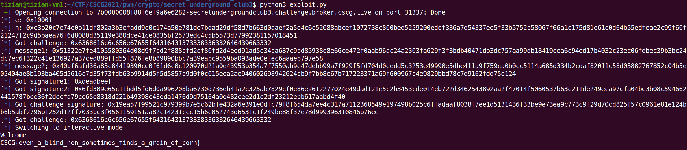

# Secret Underground Club 3

Category: Cryptography, RSA
Created: Mar 1, 2021 11:45 PM
Solved: Yes
Subjective Difficulty: 🔥🔥🔥

# WriteUp:

Author: @Tibotix

This was a challenge in the CSCG2021 Competition.

## 📃 Challenge Description:

Now the login system should be safe, right?

## 🔎 Research:

We are given almost the same python script as we did get in the *Secret Underground Club 2* challenge, except that this time we have only one request to ask the server to sign us one message.

## 📝 Vulnerability Description:

The vulnerability is the same as in the previous challenge of this series. With the arbitrary signing from the server and not hashing the message to sign, we can sign a predefined message $m$ without knowing the private key or ask the server to sign us $m$. This attack is known as a [Chosen-Message-Attack](https://crypto.stackexchange.com/questions/35644/chosen-message-attack-rsa-signature/35656).

## 🧠 Exploit Development:

The goal of this challenge is that we provide a valid signature for a challenge message that is chosen by the server. However, we could get arbitrary signatures for any chosen message except the actual challenge of course.

The signature of the challenge will be calculated with the private key like this:

$$s = m^d \pmod n$$

To get the signature $s$ , the Chosen-Message-Attack on RSA Signatures works as follows:

1. Given a signature $s_1$ of your choice, you calculate the associative message $m_1 = s_1^e \pmod n$
2. You calculate $m_2 = m * m_1^{-1}\pmod n$ and ask the server to sign that message for us.

The signature of the challenge $m$ can now be calculated with:

$$s = s_1 * s_2 = m_1^d * (m * m_1^{-1})^{d} = \cancel m_1^d * m^d * \cancel m_1^{-d} = m^d \pmod n $$

As we calculate our own message $m_1$ in the first step based on a chosen signature, we only need one signing request now.

## 🔐 Exploit Program:

```python
from pwn import *

p = remote("7b0000008f88f6ef9a6e6282-secretundergroundclub3.challenge.broker.cscg.live", 31337, ssl=True)

p.recvuntil("e=")
e = int(p.recvuntil('\n').strip(), 16)
p.recvuntil("n=")
n = int(p.recvuntil('\n').strip(), 16)

log.info("e: {0}".format(hex(e)))
log.info("n: {0}".format(hex(n)))

def get_signature(m):
	p.sendline("2") # chat
	p.recvuntil("Message:")
	p.sendline(hex(m))
	p.recvuntil("#")
	return int(p.recvline().strip(), 16)

p.sendline("1") # login
p.recvuntil("challenge:")
challenge = int(p.recvuntil('\n').strip(), 16)
log.info("Got challenge: {0}".format(hex(challenge)))
p.sendline("0x1234") # dummy to return to menu

signature1 = 0xdeadbeef # arbitrary value
message1 = pow(signature1, e, n)

message2 = challenge*pow(message1, -1, n)
log.info("message1: {0}".format(hex(message1)))
log.info("message2; {0}".format(hex(message2)))

p.recvuntil("Option:")
signature2 = get_signature(message2) # signature2 = message2**d mod(n) = (challenge*message1**(-1) mod(n))**d mod(n)

log.info("Got signature1: {0}".format(hex(signature1)))
log.info("Got signature2: {0}".format(hex(signature2)))

challenge_signature = signature1*signature2 % n
log.info("Got challenge signature: {0}".format(hex(challenge_signature)))

p.sendline("1") # login
p.recvuntil("challenge:")
challenge = int(p.recvuntil('\n').strip(), 16)
log.info("Got challenge: {0}".format(hex(challenge)))
p.recvuntil("Signature:")
p.sendline(hex(challenge_signature))

p.interactive()
```

## 💥 Run Exploit:



**FLAG: CSCG{even_a_blind_hen_sometimes_finds_a_grain_of_corn}**

## 🛡️ Possible Prevention:

To prevent this kind of attack, one should **always** hash a message before signing it. This has also the side effect that it is much more efficient as signing the whole message. But more importantly, this prevents the two $m_1^d$ to cancel each other out:

$$s_1 * s_2 = hash(m_1)^d * hash(m * m_1^{-1})^d  \not= s$$

## 🗄️ Summary / Difficulties:

This challenge was very similar to the second one of this series, except that we only had one chance to ask the server for a signing. Therefore we simple set an own signature and calculated the message backwards. In this way we had already one valid signature and only needed one call to get the second signature.

## 🗃️ Further References:

[Chosen-Message-Attack RSA-Signature](https://crypto.stackexchange.com/questions/35644/chosen-message-attack-rsa-signature/35656)

[RSA Signing](https://crypto.stackexchange.com/questions/9896/how-does-rsa-signature-verification-work)

## 🔨 Used Tools:

- python
- pwntools
