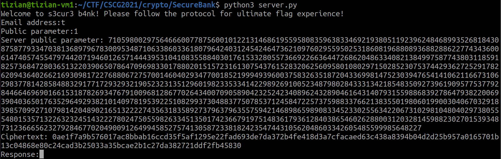

# Secure Bank

Category: Cryptography
Created: Apr 2, 2021 8:01 PM
Solved: Yes
Subjective Difficulty: 🔥🔥🔥🔥🔥

# WriteUp:

Author: @Tibotix

This was a challenge in the CSCG2021 Competition.

## 📃 Challenge Description:

The SP bAnK E2 introduced a new protocol to secure its services. But can it hold up to its promises?

Note: Do not try a online brute force attack against this service. Your chance of guessing the correct pins is negligibly small and it will just add unnecessary load to the service.

## 🔎 Research:

As the description points out, this challenge has something to do with the *SPAKE2* protocol. 

When starting the server program, it asks for an email address and a public parameter:



It will show us the servers public parameter and a ciphertext. It then asks us to input the reponse. Looking at the server code we have to somehow decrypt the given ciphertext and in in there is the challenge stored which we have to input as a response. 
When we have successfully inputted the challenge, the protocol run again, but this time encrypting the flag.

## 📝 Vulnerability Description:

We can choose `r_a` arbitrary. So we can say `r_a = email_num` . This would lead to `t_a = id_a` . Cause `id_a` is the blinding factor in `mask_client = id_a^(-pin)` , the blinding factor is canceled out the same way as `t_a` is in the final shared key calculation on the server:

On the server, `t_a` would be `t_a * ida_a^(-pin) = t_a * t_a^(-pin)` .
$$
z = t_a^{r_b} = (t_a * id_a^{-pin})^{r_b} = (t_a * t_a^{-pin})^{r_b} = t_a^{r_b} * t_a^{-pin^{r_b}} = t_a^{r_b} * t_a^{r_b^{-pin}} \pmod p
$$
We have the `server_pub = t_b * id_server^(pin) % p` . To calculate `t_b`, we have to guess the `pin` . So we brute force `pin` until we get the right `t_b` with `server_pub * id_server^(-pin)` . With the right `t_b` we can calculate the final shared key on the client side:

$$
 z = t_b^{r_a} * t_b^{r_a^{-pin}}
$$


Note that `t_a^r_b` is the same as `t_b^r_a` cause we are using the [Diffie Hellman](https://www.notion.so/Diffie-Hellman-Key-Exchange-2b19fa83455248a2b2701b7d2762829d) algorithm.

## 🧠 Exploit Development:

Now lets write a program that exploits this vulnerability.

## 🔐 Exploit Programm:

```python
from Crypto.Hash import SHA256
from Crypto.Cipher import AES
from Crypto.Util import Padding 
from Crypto.Util.number import long_to_bytes
from pwn import *
import sys
import binascii

if(len(sys.argv) < 3):
    print("Usage: python3 exploit.py <host> <port>")

host = sys.argv[1]
port = int(sys.argv[2])

#RFC 3526 Primes
prime = 0xFFFFFFFFFFFFFFFFC90FDAA22168C234C4C6628B80DC1CD129024E088A67CC74020BBEA63B139B22514A08798E3404DDEF9519B3CD3A431B302B0A6DF25F14374FE1356D6D51C245E485B576625E7EC6F44C42E9A637ED6B0BFF5CB6F406B7EDEE386BFB5A899FA5AE9F24117C4B1FE649286651ECE45B3DC2007CB8A163BF0598DA48361C55D39A69163FA8FD24CF5F83655D23DCA3AD961C62F356208552BB9ED529077096966D670C354E4ABC9804F1746C08CA18217C32905E462E36CE3BE39E772C180E86039B2783A2EC07A28FB5C55DF06F4C52C9DE2BCBF6955817183995497CEA956AE515D2261898FA051015728E5A8AAAC42DAD33170D04507A33A85521ABDF1CBA64ECFB850458DBEF0A8AEA71575D060C7DB3970F85A6E1E4C7ABF5AE8CDB0933D71E8C94E04A25619DCEE3D2261AD2EE6BF12FFA06D98A0864D87602733EC86A64521F2B18177B200CBBE117577A615D6C770988C0BAD946E208E24FA074E5AB3143DB5BFCE0FD108E4B82D120A92108011A723C12A787E6D788719A10BDBA5B2699C327186AF4E23C1A946834B6150BDA2583E9CA2AD44CE8DBBBC2DB04DE8EF92E8EFC141FBECAA6287C59474E6BC05D99B2964FA090C3A2233BA186515BE7ED1F612970CEE2D7AFB81BDD762170481CD0069127D5B05AA993B4EA988D8FDDC186FFB7DC90A6C08F4DF435C934063199FFFFFFFFFFFFFFFF
generator = 2

ID_SERVER = pow(generator, int.from_bytes(b'server', 'big'), prime)

# email_num == r_a

user_id = "tizian"
email_hash = SHA256.new(user_id.encode()).digest()
email_num = int.from_bytes(email_hash, "big")
r_a = email_num
id_a = pow(generator, email_num, prime) #the same as generator**r_a (mod prime) == t_a
t_a = pow(generator, r_a, prime)
user_pub = t_a

# t_a on server side is now: t_a * ida**-pin == id_a  * id_a**-pin == (g**r_a (mod prime)) * id_a**-pin

def try_decrypt(server_pub, pin, ciphertext):
    t_b = (server_pub * pow(ID_SERVER, -pin, prime)) % prime #if pin is correct, this would be server t_b
    #t_b == g**r_b (mod p)
    #server z should be: t_b**r_a * t_b**r_a*-pin
    z = (pow(t_b, r_a, prime) * pow(t_b, r_a*(-pin), prime)) % prime
    k = SHA256.new(long_to_bytes(id_a) + long_to_bytes(ID_SERVER) + long_to_bytes(user_pub) + long_to_bytes(server_pub) + long_to_bytes(pin) + long_to_bytes(z)).digest()
    aes = AES.new(k, AES.MODE_ECB)
    return str(Padding.unpad(aes.decrypt(ciphertext), 16), 'utf-8')

def attack(min_pin, max_pin, server_pub, ciphertext):
    for pin in range(min_pin, max_pin):
        #print(str(pin), end="\r")
        try:
            res = try_decrypt(server_pub, pin, ciphertext)
        except ValueError:
            continue
        if("Challenge" in res or "CSCG" in res):
            return res
            
            
            
            
p = remote(host, port, ssl=True)

def exploit_protocol():
    p.readline()
    p.sendline(str(user_id))
    p.sendline(str(user_pub))

    print(str(p.readuntil(": ")))
    server_pub = int(p.readline(keepends=False))
    print(str(server_pub))
    print(str(p.readuntil(": ")))
    c = p.readline(keepends=False)
    print(str(c))
    ciphertext = binascii.unhexlify(c)
    print(str(ciphertext))
    response = attack(0, 10000, server_pub, ciphertext)
    print(str(response))
    challenge = response.replace("Challenge: ", "")
    p.sendline(challenge)

exploit_protocol()
exploit_protocol()
```

## 💥 Run Exploit:


**FLAG: CSCG{i_hope_you_bank_has_better_security}**

## 🛡️ Possible Prevention:

One possible prevention would be to hash the pin again. This would prevent an brute force attack to be so fast. 

## 🗄️ Summary / Difficulties:

This challenge was a really great challenge. I enjoyed it a lot. This was the first time i solved a crypto challenge with DH and SPAKE, but it was very valuable and i learned a lot of lessons. To note, it is always good to write down the protocol flow on paper so you can have a general overview of the algorithm and potential vulnerabilities.

## 🗃️ Further References:

[Brian's Blog](http://www.lothar.com/blog/54-spake2-random-elements/)

[SPAKE2, a PAKE](https://tools.ietf.org/id/draft-irtf-cfrg-spake2-10.html)

[What's a symmetric password-authenticated key exchange (sPAKE) and how does SPAKE2 work?](https://www.cryptologie.net/article/490/whats-a-symmetric-password-authenticated-key-exchange-spake-and-how-does-spake2-work/)

## 🔨 Used Tools:

- pwntools
- python

