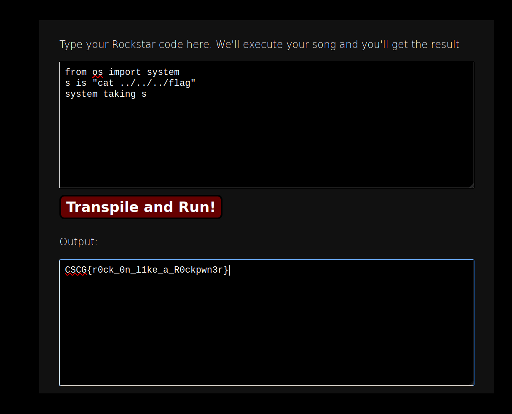

# Pwn it like a rockstar

Category: Misc
Created: Mar 23, 2021 4:15 PM
Solved: Yes
Subjective Difficulty: 🔥🔥

# WriteUp:

Author: @Tibotix

This was a challenge in the CSCG2021 Competition.

## 📃 Challenge Description:

The concept of the Rockstar programming language was written on a beer lid. Such a great start for a new language! Many people adopted the concept and wrote transpiler, interpreter and lexer for this simple, yet great language. Become a certified Rockstar developer today! And pwn the Python transpiler.

## 🔎 Research:

I first read the documentation about rockstar at [https://codewithrockstar.com/docs](https://codewithrockstar.com/docs) and the python transpiler at [https://github.com/yyyyyyyan/rockstar-py](https://github.com/yyyyyyyan/rockstar-py).

## 📝 Vulnerability Description:

The python transpiler threat code that can not be converted to python as plaintext and stores it in the python file without comments. This will allow us to import arbitrary modules such as `os`.  Furhtermore, the python transpiler doesnt check if a function that will be called through the rockstar language is defined yet. This will allow us to call arbitrary functions that are not defined by the rockstar language.

## 🧠 Exploit Development:

To get remote code execution we have to call the `system` function of the `os` module. As described below we can simply import this function with:

`from os import system`

To call this function as described below as well we can use the rockstar syntax with:

`system taking <parameter>`

The parameter we pass the system function is stored in a additional variable called `s`:

`s is "cat ../../../flag"`

## 🔐 Exploit Programm:

```python
from os import system
s is "cat ../../../flag"
system taking s
```

## 💥 Run Exploit:



**FLAG: CSCG{r0ck_0n_l1ke_a_R0ckpwn3r}**

## 🛡️ Possible Prevention:

To mitigate this vulnerability, the python transpiler should not allow to import modules. However, this would not prevent someone to just use the builtin_methods such as `open` . So to be really safe, you should run the python transpiler with lower privileges in a sand boxed environment such as a docker container.

## 🗄️ Summary / Difficulties:

Personally i enjoyed this challenge really much. It was very cool and exciting learning the syntax of the rockstar language although it is indeed very weird 🙂.

## 🗃️ Further References:

[rockstar : docs](https://codewithrockstar.com/docs)

## 🔨 Used Tools:

- firefox

