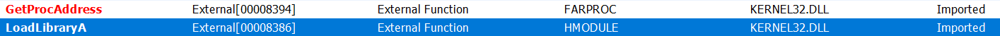

# KeyGen

Category: Reverse Engineering
Created: Mar 23, 2021 5:17 PM
Solved: Yes
Subjective Difficulty: 🔥🔥🔥🔥🔥

# WriteUp:

Author: @Tibotix

This was a challenge in the CSCG2021 Competition.

## 📃 Challenge Description:

Do you remember these times, where Key Generators where a thing? Pls provide me a nice and oldschool Key Generator for the attached file and use the Service to test your KeyGenerator.

## 🔎 Research:

I first wanted to solve this challenge with `angr`, but as the input can be anything and we simply need the associated serial, this was a infinite possibility end. WE COULD set the name in stdin at angr and let the symbolic execution gives us the serial as well as WE COULD simply input the name and let an debugger automatically retrieve the serial in the process memory, but i wanted to practice my reverse engineering skills and with an own written algorithm the results are also faster.

I didn't googled some constants but if i did i would have found out that this algorithm actually implements the [Mersenne Twister](https://en.wikipedia.org/wiki/Mersenne_Twister). 

When analyzing the given binary we can see that it is packed with the UPX packer:




to decompress it we run this command:

`upx -d -o KeyGenDecompressed.exe KeyGen.exe`

Now we are ready to finally inspect the binary.

When running the program, it asks for a name and a serial-key. It looks like each name has a specific serial-key that we have to generate. When giving the wrong Serial, the program prints out `N0P3N0P3`. Okay, so lets dive deep into the assembler code.

## 📝 Vulnerability Description:

As the given binary contains the algorithm to check for a valid serial, we can also use it to write a serial key generator. This is also the goal of this challenge.

## 🧠 Exploit Development:

So i simply started to read and translate the assembler line per line. You can see my notes further down in the *Notes* section. In the following i will explain the serial generation based on my own python implementation.

First, the name was repeatedly extended to fit whole `0x20` bytes. 

```python
class Name():
    def __init__(self, initial_name):
        self.name = self._extend_name(list(initial_name.encode("utf-8")))

    def _extend_name(self, name):
        rel = len(name)
        for i in range(len(name), 0x20):
            name.append(name[i-rel])
        return name
```

Second, the `name_key` is generated with the first `4` bytes of the name as a seed.

```python
		def get_name_key(self):
		        name_key = [] # starting at [esp+0x28]
		        name_iv = self.name_iv
		        for i in range(1, 0x270):
		            name_iv = ((name_iv>>0x1e) ^ name_iv) & 0xFFFFFFFF
		            name_iv = (name_iv * 0x6c078965) & 0xFFFFFFFF
		            name_iv += i
		            name_key.append(name_iv)
		        return name_key

    def _hex(self, bytes_):
        return "".join([hex(i)[2:] for i in bytes_])

    @property
    def hex(self):
        return self._hex(self.name)

    @property
    def name_iv(self):
        return bitstring.BitArray(hex=self._hex(self.name[:4][-1::-1])).uint
```

Then, the name is scrambled based on the `name_key` . 

```python
    def scramble_name(self, name_key, counter=0x270, nn=0xFFFFFFFF):
        for i in range(len(self.name)):
            name_key, eax = some_encryption(counter, nn, name_key, self.name_iv)
            index = eax % 0xff
            self.name[i] = self.name[i] ^ alphabet_table[index+1]
            counter += 1
```

The `some_encryption` fucntions looks like this:

```python
def some_encryption(counter, nn, orig_name_key, name):
    if(counter==0x270):
        name_key = [name] + orig_name_key
        for i in range(counter):
            ecx = name_key[i] ^ name_key[i+1]
            ecx = ecx & 0x7fffffff
            ecx = ecx ^ name_key[i]
            eax = ecx
            b = bool(bitstring.BitArray(uint=eax, length=4*8)[-1])
            if(b):
                eax = 0x9908b0df
            else:
                eax = 0x0
            ecx = ecx>>0x1
            eax = eax ^ name_key[i+397]
            eax = eax ^ ecx
            name_key.append(eax)
        eax = counter
    elif(counter>=0x4e0): # DEAD CODE
        pass
    else:
        name_key = orig_name_key

    nc = name_key[counter] # edx -> 0x9bc -> start of new generated above
    return name_key, (((((nc ^ (nn & (nc >> 0xb)) & 0xFFFFFFFF) ^ ((((nc ^ (nn & (nc >> 0xb)) & 0xFFFFFFFF) & 0xff3A58Ad) << 0x7)) & 0xFFFFFFFF) ^ ((((nc ^ (nn & (nc >> 0xb)) & 0xFFFFFFFF) ^ ((((nc ^ (nn & (nc >> 0xb)) & 0xFFFFFFFF) & 0xff3A58Ad) << 0x7)) & 0xFFFFFFFF) & 0xffffdf8C) << 0xF)) & 0xFFFFFFFF)>>0x12) ^ ((((nc ^ (nn & (nc >> 0xb)) & 0xFFFFFFFF) ^ ((((nc ^ (nn & (nc >> 0xb)) & 0xFFFFFFFF) & 0xff3A58Ad) << 0x7)) & 0xFFFFFFFF) ^ ((((nc ^ (nn & (nc >> 0xb)) & 0xFFFFFFFF) ^ ((((nc ^ (nn & (nc >> 0xb)) & 0xFFFFFFFF) & 0xff3A58Ad) << 0x7)) & 0xFFFFFFFF) & 0xffffdf8C) << 0xF)) & 0xFFFFFFFF)

```

On its first call (with counter set to `0x270`) , the `name_key` will be doubled in size with values based on the initial `name_key`. After this and on every next call this function basically just takes the entry of `name_key` at index `counter` , and returns a value from a big calculation at the end. This value is then used in the `scramble_name` function to determine the entry of the `alphabet_table` with which the name is xored. The alphabet_table is a predefined table of characters with `0xff` entries. You can find it in the  memory dump:


I converted these entries to a list and stored it as a variable in my python script:

```python
alphabet_table = [0x00, 0x1d, 0x30, 0x9f, 0x37, 0xc7,  0xc3, 0x1e, 0xe8, 0x2f, 0xe6, 0x85, 0xcf, 0x4d, 0x52, 0x3f, 0xff, 0xf8, 0xea, 0x9f, 0x3d, 0x73, 0x70, 0xa5, 0x5a, 0xde, 0x3b, 0x39, 0xb3, 0x31, 0x39, 0xa8, 0x8f, 0xe7, 0x65, 0xff, 0xa4, 0x59, 0x61, 0xc0,  0x68, 0x1e, 0xaa, 0x2b, 0x0e, 0xb0, 0xf9,  0x03, 0xf5, 0xa0, 0xb8, 0xab, 0x76, 0x5f, 0x58, 0x57, 0xeb, 0xff, 0x7d, 0x00, 0x4b, 0xe6, 0xf3, 0xfc, 0xc6, 0xc4, 0xe5, 0xbd, 0xdc, 0x48, 0xb7, 0xc4, 0x5e, 0xd8, 0x2d, 0xfd, 0xa6, 0x77, 0xb1, 0xf4, 0xd6, 0xde, 0x49, 0x19, 0x2a, 0x43, 0xfd, 0x9a, 0xda, 0x07, 0x39, 0x6e, 0x57, 0x11, 0x41, 0x61, 0x39, 0x29, 0x35, 0x53, 0xdb, 0xc0, 0x17, 0x55, 0x68, 0x2d,  0xff, 0x9b, 0x21, 0x0c, 0x2f, 0x8d, 0xe3, 0x45, 0x04, 0xfa, 0xa0, 0x60, 0xf9, 0x43, 0xad, 0x5d, 0x2d, 0xc5,  0xea, 0xfd, 0x02,  0x0a, 0x4e, 0x7d, 0xcc, 0xa4, 0xb3, 0x73, 0x07, 0xab, 0xd8, 0x70, 0x6c, 0x58, 0xf5, 0x40,  0x5f, 0x51, 0xd3, 0xf5,  0x31, 0xdd,  0x64, 0xc2, 0xae, 0x9c, 0x36, 0x04, 0xe1, 0x0d, 0x58, 0x00, 0xe5, 0x53, 0x23, 0x14, 0xb0, 0xa7, 0xd8, 0x41, 0xdd, 0x5d,  0x3f, 0x65, 0x9b, 0x93, 0xc2, 0x4d, 0xf7, 0x85, 0x37, 0xb7, 0x32, 0x49,  0x9b, 0xb3, 0x97, 0x4a, 0x1a, 0x36, 0x40,  0xd6,  0x20,  0xcc, 0x79,  0x4c, 0x48, 0xe3, 0x3f, 0x00, 0xe3, 0xd1, 0xaf, 0x48, 0x65, 0x51, 0x9a, 0xf7, 0x42, 0x7d, 0x15, 0xf3, 0x7d, 0x05, 0x0b, 0xfb, 0x76, 0x4c, 0xe8, 0xe3, 0xfe, 0x57, 0xea, 0x11, 0x61, 0xa9, 0x39, 0x26, 0x54, 0x9f, 0x30, 0x57, 0xa5, 0xd4, 0x9d, 0xc4, 0x20,  0x96, 0x82, 0xd6, 0xe0, 0x8f, 0x5c, 0x73, 0x32, 0x27, 0xac, 0x8c, 0x9d, 0x58, 0xe9, 0x3d, 0xb4, 0x30, 0xf8, 0x1e, 0x0f, 0x81, 0xd4, 0xd1]
```

At this point, we are ready to calculate the serial. 

```python
    def calculate_serial(self):
        serial = b""
        for i in range(len(self.name)-1, 0, -1):
            if((len(serial)+1)%9 == 0 and i!=len(self.name)-1):
                serial += b'-'
            idx = self.name[i] % 0x21
            serial += int.to_bytes(ascii_alphabet[idx], 1, "little")
        return serial
```

Note that the serial consists of 4 blocks each containing 8 characters except the last one with 7 chararcters. These blocks are seperated by a hyphen. The characters in each block have to match the specific entry of the `ascii_alphabet` table at index specified by the `scrambled_name`. The `ascii_alphabet` table is just another array containing these characters:

```python
ascii_alphabet = b"ABCDEFGHJKLMNPQRSTUWQYZ0123456789!"
```

This table can be also found in the strings table of the executable.

Overall it was very time consuming and i struggled a little bit with some array offsets, but in the end i was able to generate my own serial for any given username:


## 🔐 Exploit Programm:

generator.py:

```python
import bitstring
bitstring.bytealigned = True

alphabet_table = [0x00, 0x1d, 0x30, 0x9f, 0x37, 0xc7,  0xc3, 0x1e, 0xe8, 0x2f, 0xe6, 0x85, 0xcf, 0x4d, 0x52, 0x3f, 0xff, 0xf8, 0xea, 0x9f, 0x3d, 0x73, 0x70, 0xa5, 0x5a, 0xde, 0x3b, 0x39, 0xb3, 0x31, 0x39, 0xa8, 0x8f, 0xe7, 0x65, 0xff, 0xa4, 0x59, 0x61, 0xc0,  0x68, 0x1e, 0xaa, 0x2b, 0x0e, 0xb0, 0xf9,  0x03, 0xf5, 0xa0, 0xb8, 0xab, 0x76, 0x5f, 0x58, 0x57, 0xeb, 0xff, 0x7d, 0x00, 0x4b, 0xe6, 0xf3, 0xfc, 0xc6, 0xc4, 0xe5, 0xbd, 0xdc, 0x48, 0xb7, 0xc4, 0x5e, 0xd8, 0x2d, 0xfd, 0xa6, 0x77, 0xb1, 0xf4, 0xd6, 0xde, 0x49, 0x19, 0x2a, 0x43, 0xfd, 0x9a, 0xda, 0x07, 0x39, 0x6e, 0x57, 0x11, 0x41, 0x61, 0x39, 0x29, 0x35, 0x53, 0xdb, 0xc0, 0x17, 0x55, 0x68, 0x2d,  0xff, 0x9b, 0x21, 0x0c, 0x2f, 0x8d, 0xe3, 0x45, 0x04, 0xfa, 0xa0, 0x60, 0xf9, 0x43, 0xad, 0x5d, 0x2d, 0xc5,  0xea, 0xfd, 0x02,  0x0a, 0x4e, 0x7d, 0xcc, 0xa4, 0xb3, 0x73, 0x07, 0xab, 0xd8, 0x70, 0x6c, 0x58, 0xf5, 0x40,  0x5f, 0x51, 0xd3, 0xf5,  0x31, 0xdd,  0x64, 0xc2, 0xae, 0x9c, 0x36, 0x04, 0xe1, 0x0d, 0x58, 0x00, 0xe5, 0x53, 0x23, 0x14, 0xb0, 0xa7, 0xd8, 0x41, 0xdd, 0x5d,  0x3f, 0x65, 0x9b, 0x93, 0xc2, 0x4d, 0xf7, 0x85, 0x37, 0xb7, 0x32, 0x49,  0x9b, 0xb3, 0x97, 0x4a, 0x1a, 0x36, 0x40,  0xd6,  0x20,  0xcc, 0x79,  0x4c, 0x48, 0xe3, 0x3f, 0x00, 0xe3, 0xd1, 0xaf, 0x48, 0x65, 0x51, 0x9a, 0xf7, 0x42, 0x7d, 0x15, 0xf3, 0x7d, 0x05, 0x0b, 0xfb, 0x76, 0x4c, 0xe8, 0xe3, 0xfe, 0x57, 0xea, 0x11, 0x61, 0xa9, 0x39, 0x26, 0x54, 0x9f, 0x30, 0x57, 0xa5, 0xd4, 0x9d, 0xc4, 0x20,  0x96, 0x82, 0xd6, 0xe0, 0x8f, 0x5c, 0x73, 0x32, 0x27, 0xac, 0x8c, 0x9d, 0x58, 0xe9, 0x3d, 0xb4, 0x30, 0xf8, 0x1e, 0x0f, 0x81, 0xd4, 0xd1]
ascii_alphabet = b"ABCDEFGHJKLMNPQRSTUWQYZ0123456789!"

def some_encryption(counter, nn, orig_name_key, name):
    if(counter==0x270):
        name_key = [name] + orig_name_key
        for i in range(counter):
            ecx = name_key[i] ^ name_key[i+1]
            ecx = ecx & 0x7fffffff
            ecx = ecx ^ name_key[i]
            eax = ecx
            b = bool(bitstring.BitArray(uint=eax, length=4*8)[-1])
            if(b):
                eax = 0x9908b0df
            else:
                eax = 0x0
            ecx = ecx>>0x1
            eax = eax ^ name_key[i+397]
            eax = eax ^ ecx
#            print("[{0}] appening: {1}\n".format(hex(counter-i),hex(eax)))
            name_key.append(eax)
        eax = counter
    elif(counter>=0x4e0): # DEAD CODE
        pass
    else:
        name_key = orig_name_key

    nc = name_key[counter] # edx -> 0x9bc -> start of new generated above
    return name_key, (((((nc ^ (nn & (nc >> 0xb)) & 0xFFFFFFFF) ^ ((((nc ^ (nn & (nc >> 0xb)) & 0xFFFFFFFF) & 0xff3A58Ad) << 0x7)) & 0xFFFFFFFF) ^ ((((nc ^ (nn & (nc >> 0xb)) & 0xFFFFFFFF) ^ ((((nc ^ (nn & (nc >> 0xb)) & 0xFFFFFFFF) & 0xff3A58Ad) << 0x7)) & 0xFFFFFFFF) & 0xffffdf8C) << 0xF)) & 0xFFFFFFFF)>>0x12) ^ ((((nc ^ (nn & (nc >> 0xb)) & 0xFFFFFFFF) ^ ((((nc ^ (nn & (nc >> 0xb)) & 0xFFFFFFFF) & 0xff3A58Ad) << 0x7)) & 0xFFFFFFFF) ^ ((((nc ^ (nn & (nc >> 0xb)) & 0xFFFFFFFF) ^ ((((nc ^ (nn & (nc >> 0xb)) & 0xFFFFFFFF) & 0xff3A58Ad) << 0x7)) & 0xFFFFFFFF) & 0xffffdf8C) << 0xF)) & 0xFFFFFFFF)

class Name():
    def __init__(self, initial_name):
        self.name = self._extend_name(list(initial_name))

    def _extend_name(self, name):
        rel = len(name)
        for i in range(len(name), 0x20):
            name.append(name[i-rel])
        return name

    def get_name_key(self):
        name_key = [] # starting at [esp+0x28]
        name_iv = self.name_iv
        for i in range(1, 0x270):
            name_iv = ((name_iv>>0x1e) ^ name_iv) & 0xFFFFFFFF
            name_iv = (name_iv * 0x6c078965) & 0xFFFFFFFF
            name_iv += i
            name_key.append(name_iv)
        return name_key

    def scramble_name(self, name_key, counter=0x270, nn=0xFFFFFFFF):
        for i in range(len(self.name)):
            name_key, eax = some_encryption(counter, nn, name_key, self.name_iv)
            index = eax % 0xff
            self.name[i] = self.name[i] ^ alphabet_table[index+1]
            counter += 1

    def calculate_serial(self):
        serial = b""
        for i in range(len(self.name)-1, 0, -1):
            if((len(serial)+1)%9 == 0 and i!=len(self.name)-1):
                serial += b'-'
            idx = self.name[i] % 0x21
            serial += int.to_bytes(ascii_alphabet[idx], 1, "little")
        return serial

    def _hex(self, bytes_):
        return "".join([hex(i)[2:] for i in bytes_])

    @property
    def hex(self):
        return self._hex(self.name)

    @property
    def name_iv(self):
        return bitstring.BitArray(hex=self._hex(self.name[:4][-1::-1])).uint

def keygen(name):
    name = Name(name)
    name_key = name.get_name_key()
    name.scramble_name(name_key)
    serial = name.calculate_serial()
    return serial

if(__name__ == "__main__"):
    name = input("Name: ")
    serial = keygen(name.encode("utf-8"))
    print("serial: {0}".format(str(serial)))
```

exploit.py:

```python
from pwn import *
import sys
import generator

initial_name = b"tibotix"
initial_serial = b"LGGH8MDC-P97631PU-PH2C0ZT3-K6QGUDW"

if(len(sys.argv)<3):
    print("Usage: python3 exploit.py <host> <port>")
    sys.exit(0)

host = sys.argv[1]
port = int(sys.argv[2])

p = remote(host, port, ssl=True)

p.recvuntil("Name: ")
p.sendline(initial_name)
p.recvuntil(b"Serial: ")
p.sendline(initial_serial)

p.recvuntil("'")
name = p.recvuntil("'")[:-1]
print(str(name))
serial = generator.keygen(name)
p.sendline(serial)
p.recvline()
flag = p.recvline()

print("[+] Flag found: {0}".format(str(flag)))
```

## 💥 Run Exploit:


**FLAG: CSCG{0ld_sch00l_k3y5_4r3_th3_b35t_k3y5}**

## 🛡️ Possible Prevention:

Offline key validation are always a bad idea. As long as the program is offline and performs the key validation algorithm, this algorithm can be reversed to generate an own valid key. Certainly one could make things harder by adding more obfuscation and encryption to the algorithm but that does not give you a fully protection. When only checking for one universal serial number you could of course use a hash function and store the hash in the binary. But when you want to check a key for any given user, an online based solution is the way to go. Using this approach one should have a centralized database containing the serial keys.  When validating a key for a given user, the program sends a validation request to the server with the given serial and namet that will be checked. The server then responds with a failure or success massage. This response should obviously be signed by the servers private key and be verified by the server public key, which will be stored in the binary, and should contain some random nonce to prevent replay attacks.

## 🗄️ Summary / Difficulties:

In the beginning try to let the program do the algorithm. Overall it was not difficult but rather very "noisy" with this many steps we had to reverse. Anyways i enjoyed this challenge a lot and i definitely learned and practiced a lot new stuff. 
However on new rev challenges i would overthink my stategy to solve it.

## 🗃️ Further References:

[Using reverse engineering techniques to see how a common malware packer works](https://labs.detectify.com/2016/04/12/using-reverse-engineering-techniques-to-see-how-a-common-malware-packer-works/)

[angr](http://angr.io/blog/angr_symbion/)

## 🔨 Used Tools:

- x32dbg
- pwntools

---

# Notes:

- main address `0x004010A0`

```python
#alphabet_table is at [0x403160]

xmm0 = "ABCDEFGHJKLMPQRSTUWQYZ0123456789!\x00\x00" # at 0x403108
ax = "9!"
ecx = &[esp+0x13D4] # beginning of literals+digits alphabet
[esp+0x13F4] = ax
edx = &"!" # end of alphabet
al = [0x40312A] -> 0x00
add esp, 0x4
[esp+0x13D0] = xmm0 # store the literals+digits alphabet (byte-swapped)
[esp+0x13F2] = al # terminate the alphabet

[esp+0xF] = 0x1
al = byte ptr:[ecx]
[esp+0x18] = "!"

vfscanf("%32s", name) # name is at [esp+0x13AC] (byte-swapped)

edx = len(name)
edi = 0x20-edx
for i in range(edi):
	name[i+edx] = name[i] #will append to name so name fills 0x20 bytes

edi = name #name is now that repeated orig name
name += '\x00' #add null terminator
ecx = name[1:]
edi=len(name) -> 0x20??

vfscanf("%36s", serial) # serial is at [esp+1400]

[esp+0x13A4] = 0xFFFFFFFF
edx = name
[esp+0x24] = edx #only first 4 bytes (byte-swapped)
for i in range(1, 0x270+1):
	edx = (eax>>0x1E ^ edx) * 0x6c078965
	edx += i
	[esp+0x24+(i*4)] = edx #append edx to the stream beginning at [esp+0x24]
# this will fill the [esp+0x24] value with an initial key
[esp+0x20] = 0x270

edi = 0xff
esi = 0

for i in range(4):
	ecx = &[esp+0x20] #-> 0x270 ->? address of this stack value this with the prepared data at beginning is maybe some key
	
	some_encryption() #this will set eax
	edx = 0
	ecx = &[esp+0x20] # -> now is 0x271
		edx = eax % edi # edi = 0xff
	byte ptr:[&name+(i*8)] ^ alphabet_table[edx] # byte ptr:[edx*4 + 0x403160]
	
	some_encryption() #this will set eax
	edx = 0
	ecx = &[esp+0x20]
		edx = eax % edi # edi = 0xff -> so this will return values between [0;254] -> alphabet table index
	byte ptr:[&name+1+(i*8)] ^ alphabet_table[edx]
	
	some_encryption() #this will set eax
	edx = 0
	ecx = &[esp+0x20]
		edx = eax % edi # edi = 0xff
	byte ptr:[&name+2+(i*8)] ^ alphabet_table[edx]
	
	[...]
	
	some_encryption() #this will set eax
	edx = 0
	ecx = &[esp+0x20]
		edx = eax % edi # edi = 0xff
	byte ptr:[&name+8+(i*8)] ^ alphabet_table[edx]
	#this will set the 32 name bytes with bytes from the alphabet table in an order specified by some_encryption
	

edi = [esp+0x14] -> 0x20 from top
esi = 0
edi = edi - 1 # len(name) -1 
if(edi>0):
	[esp+0x14] = 0x9
	edx = 1 - &serial
	[esp+0x10] = edx
	#------
	while(edi>0):
		ecx = &serial
		ecx = ecx + esi
		eax = &[ecx+edx] # -> 1
		cdq # if eax is negative, set edx=0xffffffff -> extends value to 64bit using edx
		idiv [esp+0x14] # edx:eax / [esp+0x14] (edx:eax / 0x9)
			edx = edx:eax % [esp+0x14]
		if(edx==0 and esi>0):
			eax = "0x000000" + byte ptr:[esp+0xF]
			if(byte ptr:[ecx]==0x2D): edx = eax
			al = dl
			byte ptr:[esp+0xF] = al
		else:
			eax = "0xffffff" + byte ptr:[&name+edi]
			edx = 0
			eax = "0x000000" + al
			edi -= 1
			div [esp+0x18] # [esp+0x18] -> '!' -> 0x21
				edx = edx:eax % [esp+0x18]
			xor byte ptr:[ecx], byte ptr:[&lit_dig_alphabet+edx] # [ecx] -> serial
			edx = 0
			cl = byte ptr:[ecx]
			eax = "0x000000" + byte ptr:[esp+0xF]
			if(cl==0): edx = eax
			al = dl
			byte ptr:[esp+0xF] = dl
		edx = [esp+0x10]
		esi += 1
	if(al==0):
		esi = [esp+0x10] = "0xffffff" + [esp+0x13EA]
		ecx = [esp+0x18] = "0xffffff" + [esp+0x13DD]
		edx = [esp+0x14] = "0xffffff" + [esp+0x13E7]
		eax = "0xffffff" + [esp+0x13DC]
		edi = eax
		goto CALLKEYGEN

edx = [esp+0x1c] = "0xffffff" + byte ptr:[esp+0x13e7]
eax = [esp+0x14] = "0xffffff" + byte ptr:[esp+0x13d2]
ecx = "0xffffff" + byte ptr:[esp+0x13df]
edi = "0xffffff" + byte ptr:[esp+0x13ea]
esi = ecx
[esp+0x18] = "0xffffff" + byte ptr:[esp+13e1]
[esp+0x10] = "0xffffff" + byte ptr:[esp+13f1]

CALLKEYGEN:
call keygen.401020("%c%c%c%c%c%c%c%c", eax, edx, ecx, esi, edi, [esp+0x1c], [esp+0x18], [esp+0x10])

ecx = [esp+0x1460]
eax = 0
pop edi
pop esi
ecx = ecx ^ esp
call keygen.4015D4

# edx = last remainder
# ecx is some counter at [esp+0x20]
def some_encrytion(param_1):
	push ecx, esi, edi # to restore those constants afterwards
	edi = ecx
	[ebp-0x4] = edi
	eax = dword ptr:[edi]
	if(dword ptr:[edi] == 0x270):
		edx = &[edi+0x8]
		for esi in range(eax, 0x0, -1): #while(esi!=0):
			ecx = dword ptr:[edx-0x4]
			edx = &[edx+0x4]
			ecx = ecx ^ [edx-0x4]
			ecx = ecx  & 0x7fffffff
			ecx = ecx ^ [edx-0x8]
			eax = ecx
			al = al & 0x1 # entweder 1 oder 0
			eax = "0x000000" + al
			eax = -eax # CF = 0 if (eax==0) else 1
			eax = -CF # eax = 0x00 if (eax==0) else 0xff
			ecx = ecx>>0x1
			eax = eax & 0x9908b0df
			eax = eax ^ dword ptr:[edx+0x62c]
			eax = eax ^ ecx
			[edx+0x9B8] = eax
		eax = dword ptr:[edi]
	elif(dword ptr:[edi]>=0x4e0):
		eax = [edi+0x9c4]
		push ebx
		ebx = edi+0x9c4
		for edi in range(0xe3, 0x1, -1):
			ecx = [ebx+0x4]
			edx = ebx+0x4
			ecx = ecx ^ eax
			ecx = ecx & 0x7fffffff
			ecx = ecx ^ eax
			eax = ecx
			al = al & 0x1
			eax = "0x000000" + al
			eax = -eax
			eax = -CF
			ecx = ecx>>0x1
			eax = eax & 0x9908b0df
			eax = eax ^ [ebx+0x634]
			eax = eax ^ ecx
			[ebx+0x9c0] = eax
			ebx = edx
			eax = [edx]
		ebx = [ebp-0x4]
		ebx = ebx + 0xd50
		eax = dword ptr:[ebx]
		for edi in range(0x18C, 0x0, -1):
			ecx = eax
			edx = ebx+0x4
			ecx = ecx ^ dword ptr:[edx]
			ecx = ecx & 0x7fffffff
			ecx = ecx ^ aex
			eax = ecx
			al = al & 0x1
			eax = "0x000000" + al
			eax = -eax
			eax = -CL
			ecx = ecx>>0x1
			eax = eax & 0x9908b0df
			eax = eax ^ [ebx-0xd4c]
			eax = eax ^ ecx
			[ebx-0x9c0] = eax
			ebx = edx
			eax = [edx]
		edi = [ebp-0x4]
		pop ebx
		ecx = [edi+0x1380]
		ecx = ecx ^ [edi+0x4]
		ecx = ecx & 0x7fffffff
		ecx = ecx ^ [edi+0x1380]
		eax = ecx
		al = al & 0x1
		eax = "0x000000" + al
		eax = -eax
		eax = -CF
		ecx = ecx>>0x1
		eax = eax & 0x9908b0df
		eax = eax ^ [edi+0x634]
		eax = eax ^ ecx
		[edi+0x9c0] = eax
		eax = 0
		[edi] = 0
		
		
		

	edx = [edi+eax*4+0x4]
	eax += 1
	[edi] = eax
	ecx = edx
	eax = [edi+0x1384]
	ecx = ecx >> 0xB
	eax = eax & ecx
	edx = edx ^ eax
	eax = edx
	eax = eax & 0xff3A58Ad
	eax = eax << 0x7
	edx = edx ^ eax
	eax = eax & 0xffffdf8C
	eax = eax << 0xF
	edx = edx ^ eax
	eax = edx
	eax = eax >> 0x12
	eax = eax ^ edx
	pop edi
	pop esi
		
	

def keygen.401020():
	vfprintf(0x24, 0x00, STDOUT, param1, 0, param2) # 0x404380 -> 0x7AADA0CBFFFFFFFF

	#restore edi
	#restore esi

```